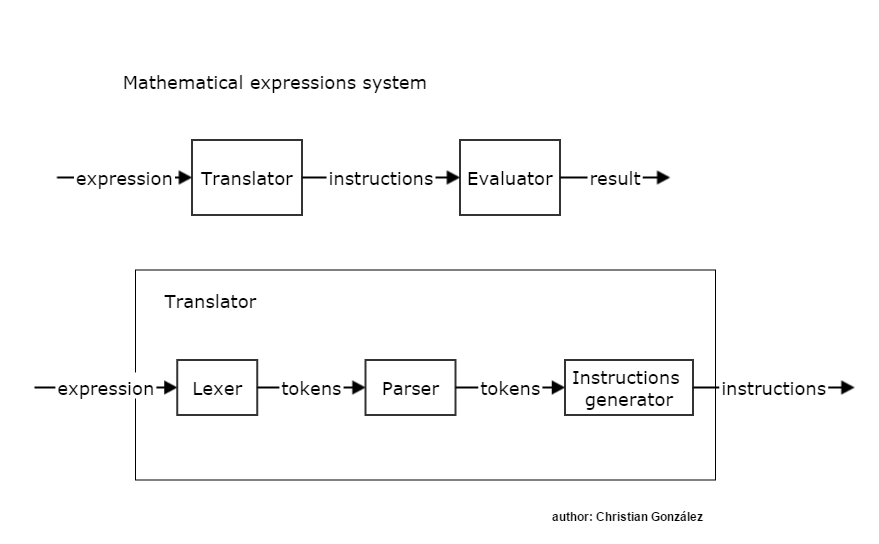
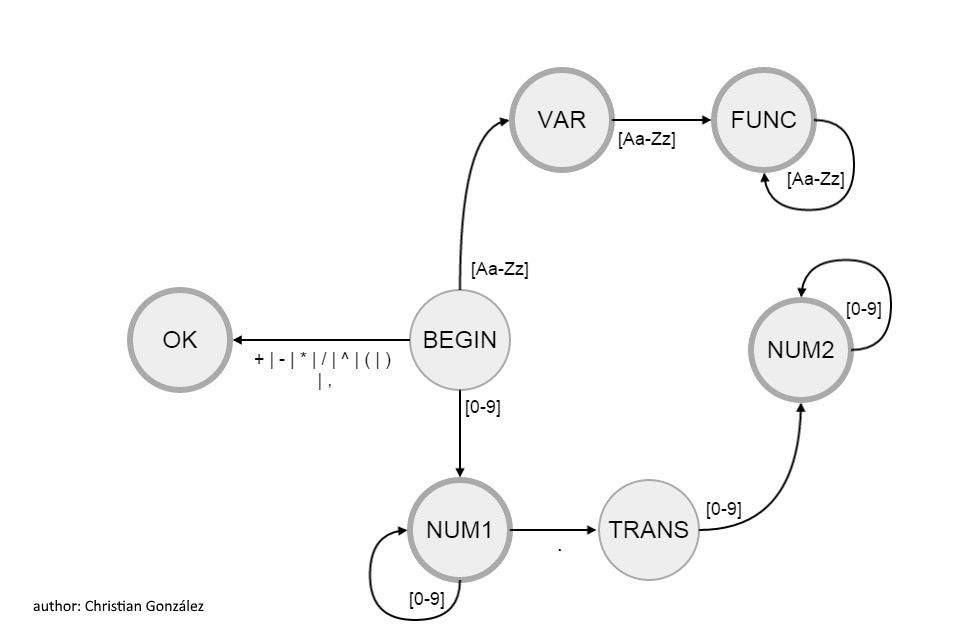

# The chrishenx' Math Expression System

Currently, there are just one implementation available; The C# one. 

The system's block diagram:

The system's automaton used by the lexer as part of the translation process.

